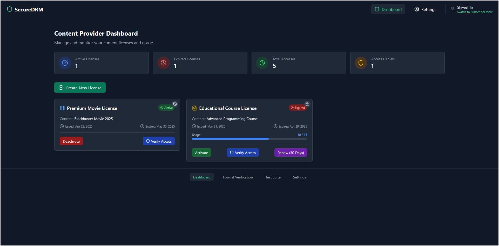
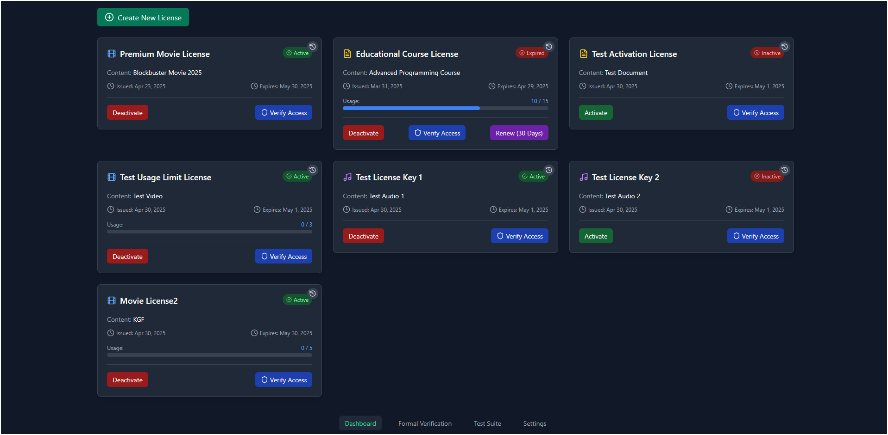
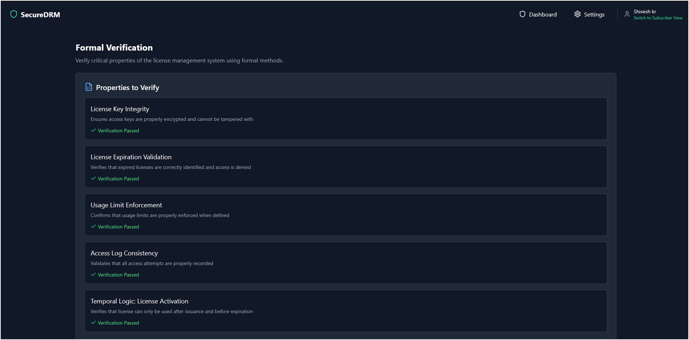
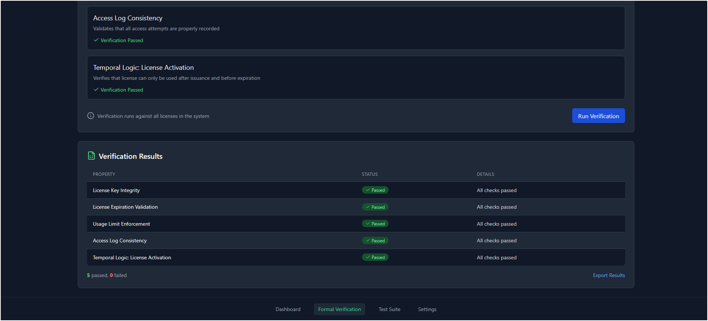
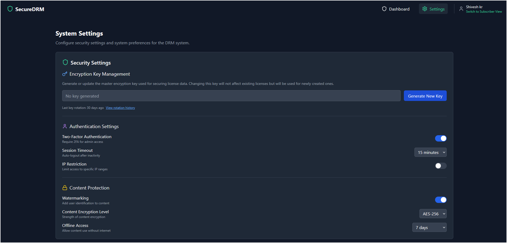
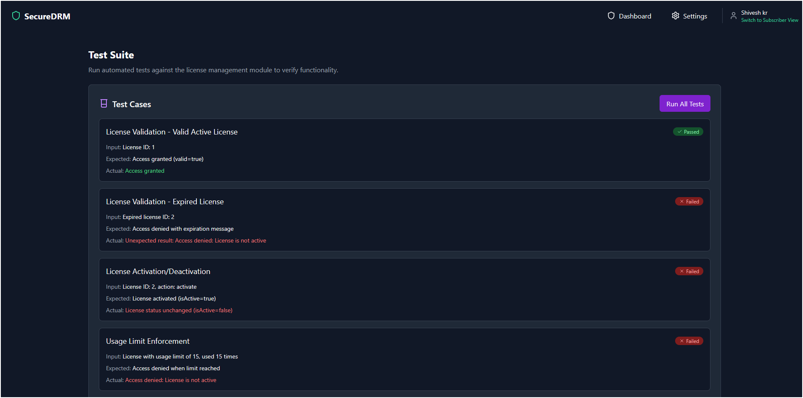
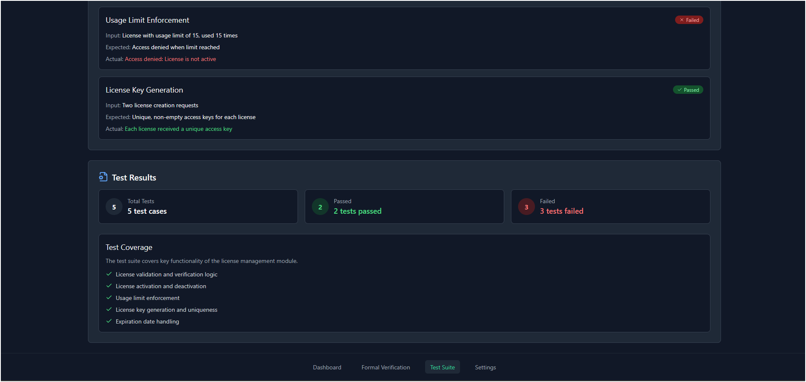

[Live run: ✈️](https://drm-wk6a.vercel.app/)

DRM website

# DRM (Digital Rights Management) System

A robust Digital Rights Management system built with React and TypeScript for secure content distribution and license management.





## Features

- **License Management**
  - Create and manage digital licenses
  - Set expiration dates and usage limits
  - Track license usage and access history
  - Activate/deactivate licenses

- **Access Control**
  - Secure content distribution
  - Device-based access control
  - Usage tracking and monitoring
  - Real-time access verification

- **Formal Verification**
  - Automated property verification
  - License validation checks
  - Access control verification
  - System state consistency checks

- **Security Features**
  - Encrypted license keys
  - Device fingerprinting
  - Access logging and monitoring
  - Session management

## Tech Stack

- **Frontend**: React 18, TypeScript
- **Styling**: TailwindCSS
- **Icons**: Lucide React
- **State Management**: React Context API
- **Build Tool**: Vite

## Prerequisites

- Node.js (v18 or higher)
- npm or yarn

## Installation

1. Clone the repository:
   ```bash
   git clone https://github.com/yourusername/drm-system.git
   ```

2. Navigate to the project directory:
   ```bash
   cd drm-system
   ```

3. Install dependencies:
   ```bash
   npm install
   ```

4. Start the development server:
   ```bash
   npm run dev
   ```

5. Open [http://localhost:5173](http://localhost:5173) in your browser

## Project Structure

```
src/
├── components/          # React components
│   ├── AccessLogs.tsx   # Access logging component
│   ├── Dashboard.tsx    # Main dashboard view
│   ├── LicenseCard.tsx  # License display component
│   └── ...
├── context/            # React Context providers
│   └── LicenseContext.tsx
├── types/              # TypeScript type definitions
│   └── index.ts
├── utils/              # Utility functions
│   └── cryptoUtils.ts   # Encryption utilities
└── App.tsx             # Main application component
```

## Key Features Implementation

### License Management
- Create, activate, and deactivate licenses
- Set expiration dates and usage limits
- Track license usage and access history
- Real-time license validation

### Security Implementation
- Encryption for license keys
- Access control based on device fingerprinting
- Comprehensive logging system
- Session management and verification

### Formal Verification
- Automated property verification
- State consistency checks
- Access control validation
- License integrity verification

## Testing

Run the test suite:

```bash
npm test
```

The system includes:
- Unit tests for core components
- Integration tests for license management
- Formal verification tests
- Security validation tests

## Quality Attributes

1. **Security**
   - Encrypted license management
   - Secure access control
   - Comprehensive audit logging

2. **Performance**
   - Optimized license validation
   - Efficient state management
   - Quick response times

3. **Maintainability**
   - Modular architecture
   - Clean code practices
   - Comprehensive documentation

4. **Scalability**
   - Stateless components
   - Efficient data structures
   - Optimized rendering

## Contributing

1. Fork the repository
2. Create your feature branch (`git checkout -b feature/AmazingFeature`)
3. Commit your changes (`git commit -m 'Add some AmazingFeature'`)
4. Push to the branch (`git push origin feature/AmazingFeature`)
5. Open a Pull Request

## License

This project is licensed under the MIT License - see the [LICENSE](LICENSE) file for details.

## Authors

- Shivesh Kumar - *Initial work* - [Github](https://github.com/Alphashivesh)

## Acknowledgments

- React.js community
- TailwindCSS team
- All contributors who helped with testing and feedback

## Contact

Shivesh Kumar - [Send me an email](mailto:shiveshkumar73520gmail.com)

Project Link: 

## Snapshorts

1. **Formal Verification**





2. **System status**



3. **Testing**




